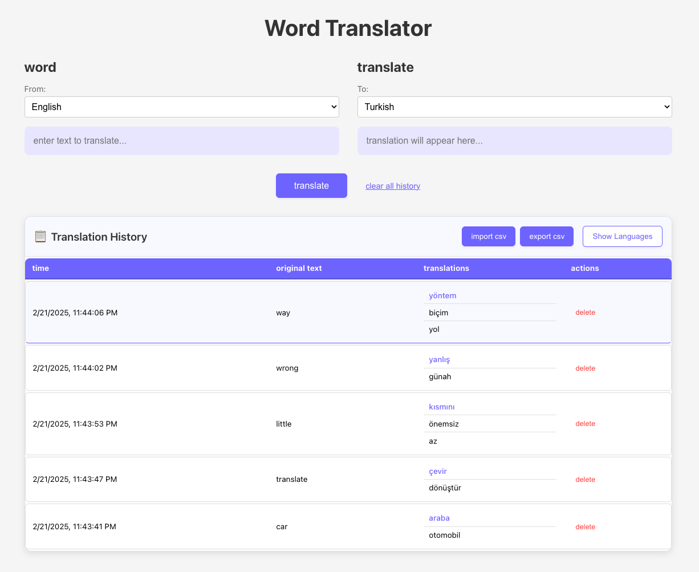

# Word Translator

A modern, user-friendly word translation application built with React that allows users to translate text between multiple languages. The application features a clean interface, translation history management, and import/export capabilities.

> This project was developed using [Cursor](https://cursor.sh), the world's most powerful AI-powered code editor.



## Features

- **Real-time Translation**: Instantly translate text between multiple languages
- **Multiple Language Support**: Supports 13 languages including:
  - English
  - Turkish
  - Spanish
  - French
  - German
  - Italian
  - Portuguese
  - Russian
  - Japanese
  - Korean
  - Chinese
  - Arabic
  - Hindi

- **User-Friendly Interface**:
  - Clean and modern design
  - Single-line input fields
  - Enter key support for quick translation
  - Text selection detection
  - Last translation highlighting

- **Translation History**:
  - Automatic saving of all translations
  - Persistent storage across sessions
  - Delete individual translations
  - Clear entire history
  - Export history to CSV
  - Import translations from CSV

## Technologies Used

- React 18
- Styled Components
- Axios
- MyMemory Translation API
- Local Storage API
- Cursor AI Code Editor

## Getting Started

### Prerequisites

- Node.js (version 14 or higher)
- npm or yarn

### Installation

1. Clone the repository:
```bash
git clone https://github.com/mucahitimre/MultiTranslate.git
cd MultiTranslate
```

2. Install dependencies:
```bash
npm install
# or
yarn install
```

3. Start the development server:
```bash
npm start
# or
yarn start
```

4. Open [http://localhost:3000](http://localhost:3000) to view it in your browser.

## Usage

1. **Basic Translation**:
   - Enter text in the "word" field
   - Select source and target languages
   - Press Enter or click "translate"

2. **Text Selection**:
   - Select any text on the page
   - It will automatically appear in the translation input

3. **History Management**:
   - View all previous translations in the table below
   - Delete individual translations using the delete button
   - Clear entire history with "clear all history"
   - Last translation is highlighted for easy reference

4. **Import/Export**:
   - Export translations to CSV using "export csv"
   - Import previous translations using "import csv"

## API Reference

This application uses the MyMemory Translation API. The API is free for personal use with some rate limitations:
- 1000 requests per day
- No API key required for personal use
- Rate limiting applies

## Contributing

1. Fork the repository
2. Create your feature branch (`git checkout -b feature/AmazingFeature`)
3. Commit your changes (`git commit -m 'Add some AmazingFeature'`)
4. Push to the branch (`git push origin feature/AmazingFeature`)
5. Open a Pull Request

## License

This project is licensed under the MIT License - see the [LICENSE](LICENSE) file for details.

## Acknowledgments

- Translation service provided by [MyMemory](https://mymemory.translated.net/)
- UI inspiration from modern web applications
- React and its amazing ecosystem
- Built with [Cursor](https://cursor.sh) - The AI-first code editor
- Special thanks to the open-source community

---
<div align="center">
  <sub>Built with ❤️ using <a href="https://cursor.sh">Cursor</a>, the AI-first code editor.</sub>
</div> 